# MLOps Proyecto Final - Predicción de Precios de Propiedades
**Grupo 9 - Pontificia Universidad Javeriana**
**Sara Juliana Cárdenas Bohórquez**

Sistema completo de MLOps para predicción de precios de propiedades en USA, con reentrenamiento inteligente basado en drift detection, CI/CD automatizado y observabilidad.

---

## 📋 Arquitectura

```
GitHub Actions (CI/CD) → DockerHub → Kubernetes
                                         ↓
┌──────────────────────────────────────────────────────────┐
│  Airflow → PostgreSQL (RAW/CLEAN/MLflow metadata)       │
│     ↓                                                     │
│  MLflow ← MinIO (artifacts)                              │
│     ↓                                                     │
│  FastAPI ← Prometheus → Grafana                          │
│     ↑                                                     │
│  Streamlit UI                                            │
└──────────────────────────────────────────────────────────┘
```

**Características**: Reentrenamiento automático con drift detection (KS test), 3 modelos (Ridge, RF, XGBoost), API con métricas Prometheus, UI Streamlit.

---

## 📦 Dataset

**API Externa**: http://10.43.100.103:8000 (Grupo 9, día Tuesday)  
**Variables**: 11 features → `price` (target)  
**Sampling**: Petición #1: 145k registros (baseline), Peticiones #2-5: 10k cada una  
**Total procesado**: ~185k registros

Como prueba inicial de la API, extraje los datos para familiarizarme y evaluar la cantidad de datos por petición: 

De estas petición, se realizaron obtuve un archivo en formato json con las variables y


Dado que los datos venían en un formato .json cree una función para convertirlos en .csv y confirmar que los podia procesar correctamente

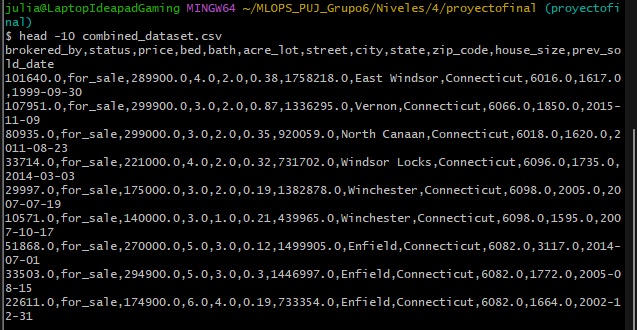

---

## 🛠️ Componentes

### PostgreSQL
**1 instancia, 3 databases**: `raw_data`, `clean_data`, `mlflow_metadata`

### Airflow (4 DAGs)

Evidencia
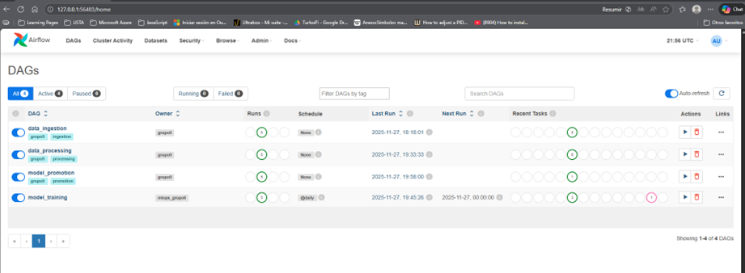
### Airflow (4 DAGs)

1. **`data_ingestion`**: GET API → Sampling (145k primera, 10k resto) → PostgreSQL RAW

Visualización
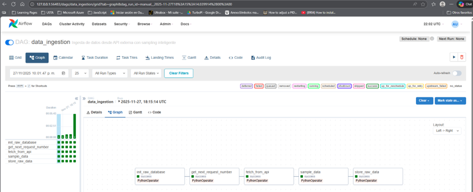

Podemos ver que la tabla raw_data se inicializa
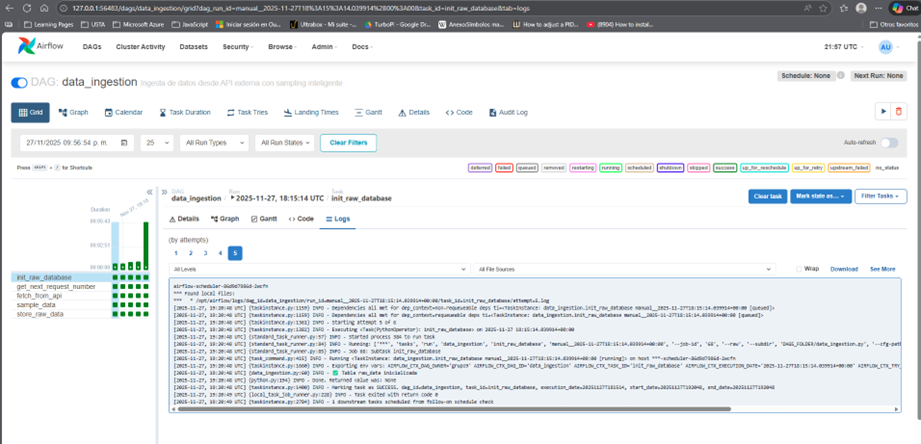

Podemos ver que se ha hecho la 1ra petición a la API
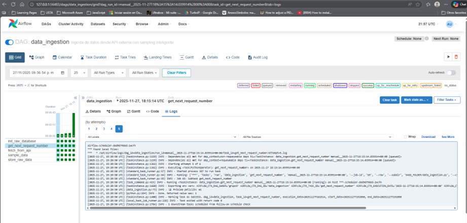

Se consumen los datos, el la primera petición se reciben 230366 registros


Se hace un sampling y selecciono 145000 datos, esto debido a una restriccion de infraestructura (nota: cuando intento entrenar con más datos el sistem se cae y tengo que reiniciar, así que limito los registros para mantener los servicios arriba)
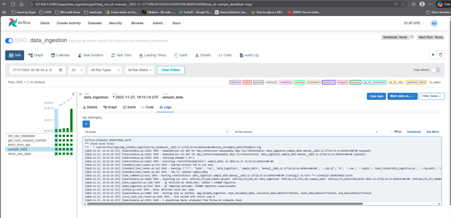

Se almacenan los datos en raw_data para continuar con el proceso
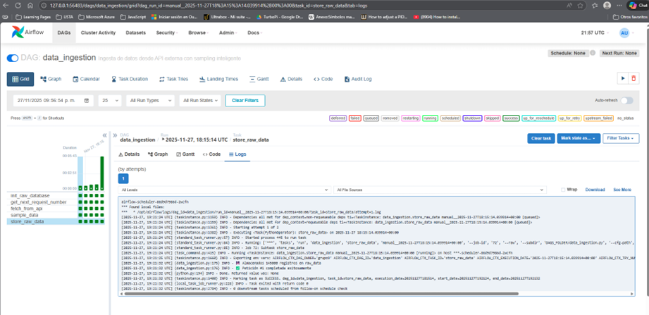

2. **`data_processing`**: RAW → Limpieza + Encoding → CLEAN

Visualización
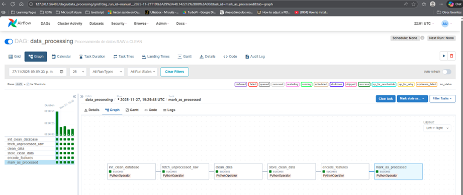

clean_data se inicializa
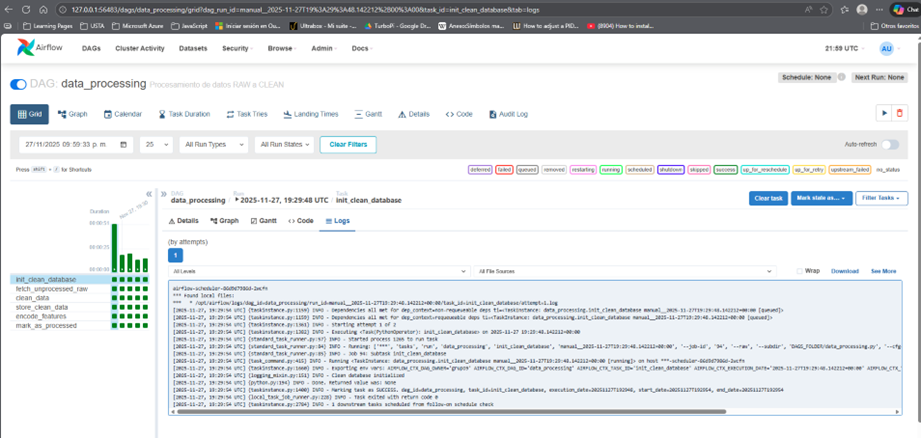

Se evalua cada batch para confirmar si ya se proceso, o si aún no, en este caso se procesa la petición #1
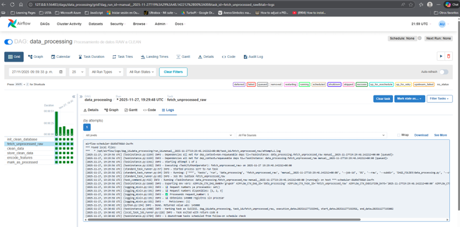

Se hace la limpieza de datos y se elimina el % de datos correspondiente
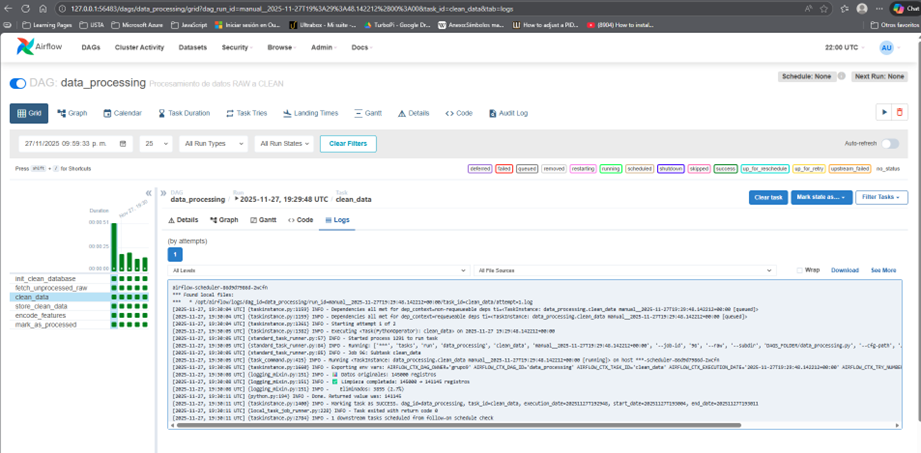

Se guardan los datos en clean_data


Se realiza el encoding de las variables independientes


Se marca como procesado el batch de datos


3. **`model_training`**: Drift detection (KS test) → Train 3 modelos → MLflow

Visualización:
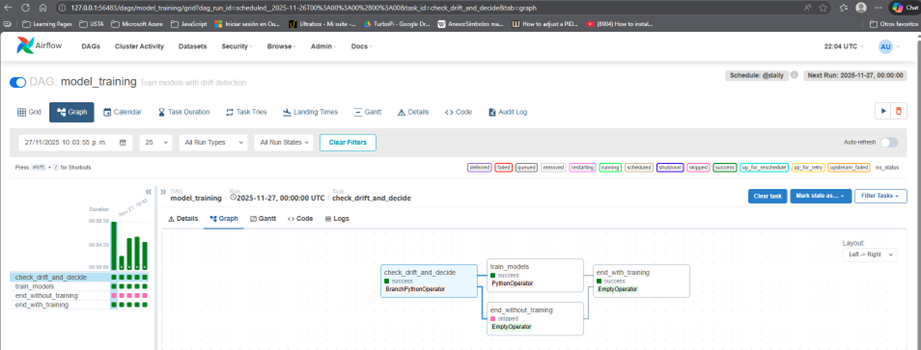

Verificación del drift 
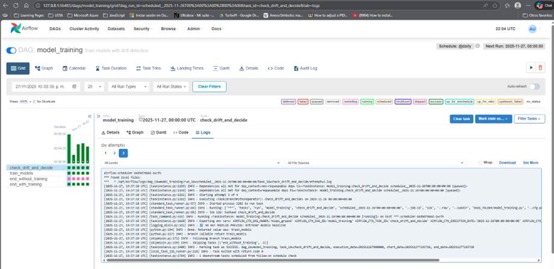

Entrenamiento de los 3 modelos: Random Forest, XGBoost y Ridge
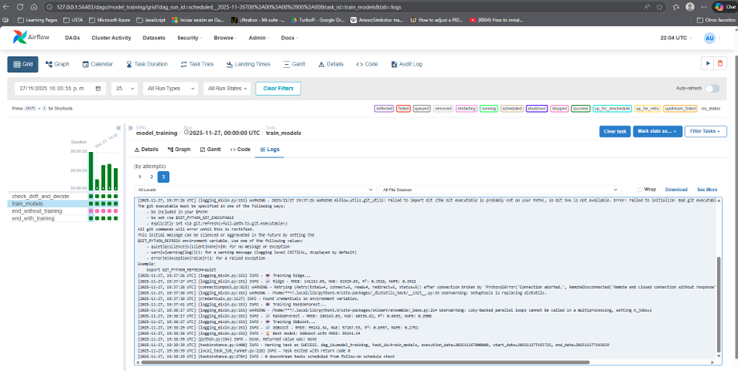

4. **`model_promotion`**: Mejor RMSE → Production stage

Visualización
Selecciona el mejor modelo y lo envía a producción
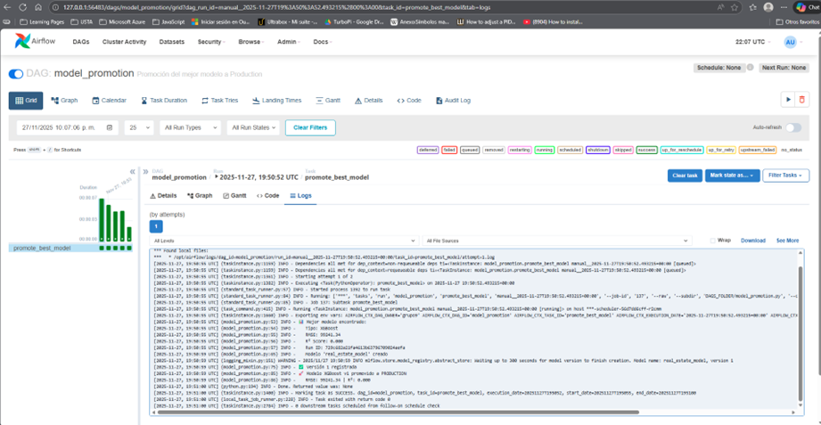

**Criterio de reentrenamiento**: `len(new_data) >= 10000 AND (drift_detected OR first_request)`

### FastAPI
**Endpoints**: `/predict`, `/health`, `/reload_model`, `/metrics`  
**Métricas Prometheus**: `predictions_total`, `prediction_latency_seconds`, `prediction_errors_total`, `model_rmse`

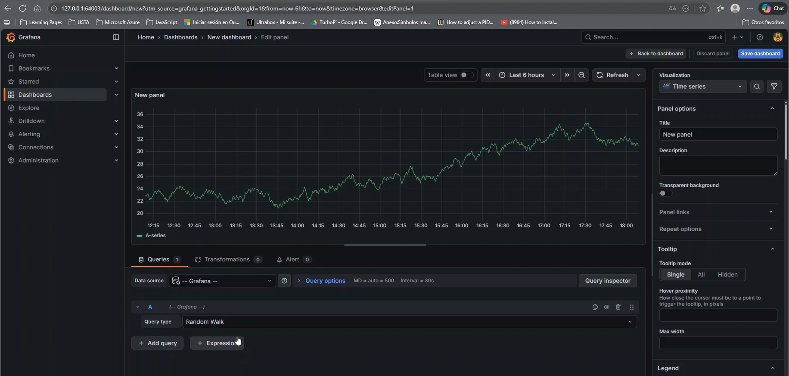

### Streamlit UI
**Páginas**: Predicción (formulario + resultado), Historial de modelos

Predicción + modelo
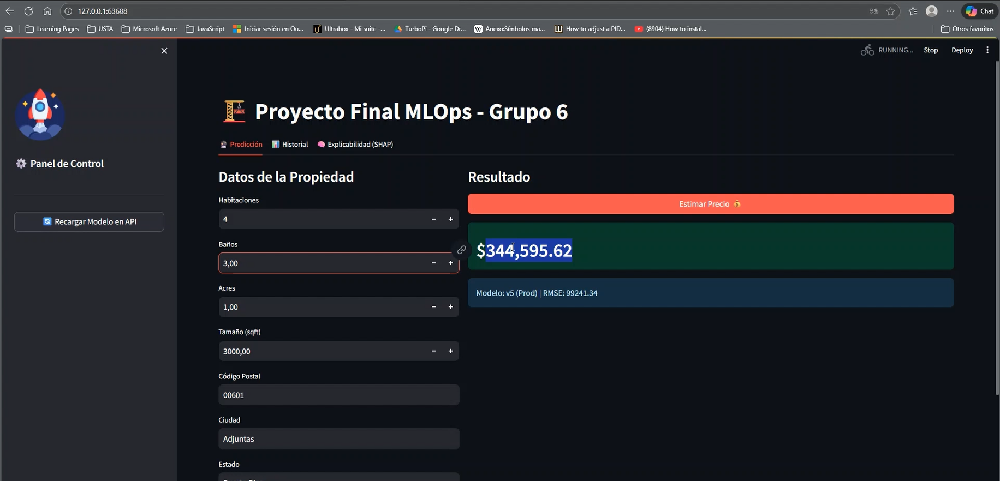

Historial de modelos
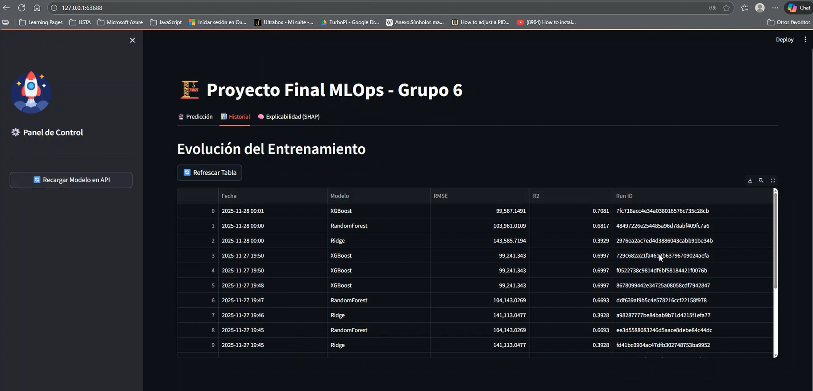

### MinIO + MLflow
**Artifacts**: Modelos, métricas, logs → S3-compatible storage

Modelos


Metricas

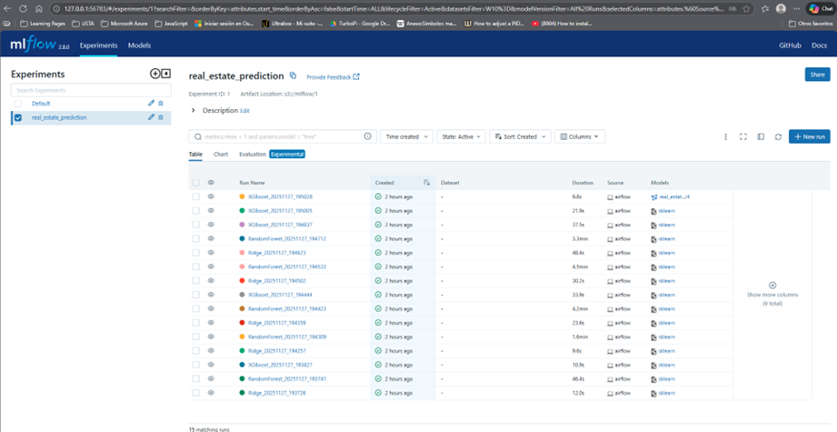

MinIo

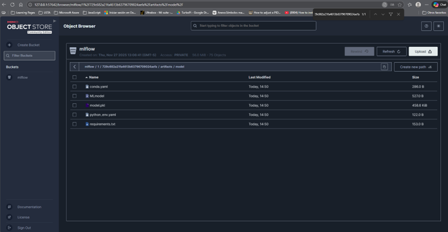

### Prometheus + Grafana
**Métricas**: Request rate, latencia (p50/p95/p99), error rate, RMSE
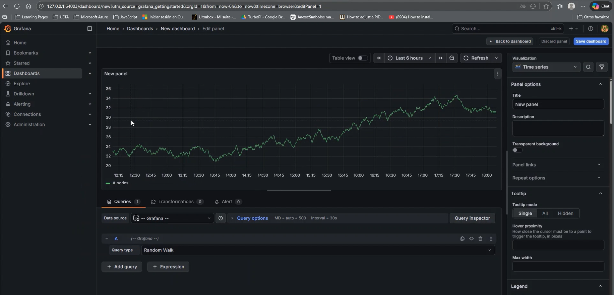

---

## 🚀 Instalación

### 1. Requisitos
- Docker Desktop
- Minikube (16GB RAM, 6 CPUs)
- kubectl
- DockerHub account

### 2. Setup Inicial --> Completado
```bash
git clone <tu-repo>
cd mlops-proyecto-final
cp .env.example .env
# Editar .env con tus credenciales
```

### 3. Configurar GitHub Secrets
En GitHub: Settings → Secrets → New secret
- `DOCKERHUB_USERNAME`: tu usuario
- `DOCKERHUB_TOKEN`: token de acceso

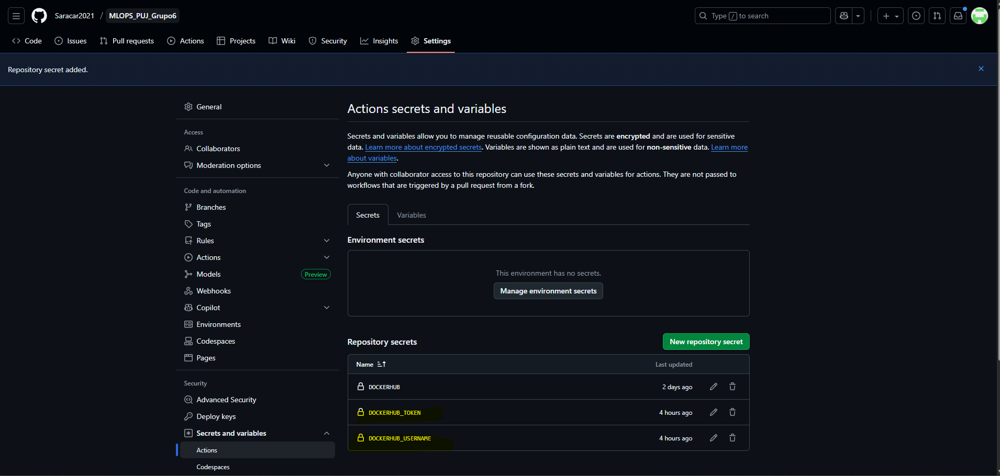

### 4. Actualizar manifiestos K8s
**IMPORTANTE**: Reemplazar `YOUR_DOCKERHUB_USERNAME` con tu usuario en:
- `k8s/airflow/all-in-one.yaml` (líneas 90, 101, 135)
- `k8s/api/all-in-one.yaml` (línea 14)
- `k8s/ui/all-in-one.yaml` (línea 14)

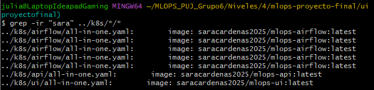

### 5. Build y Push de imágenes

**Opción A: GitHub Actions (recomendado)**
```bash
git add .
git commit -m "feat: configuración inicial"
git push origin main
# GitHub Actions construirá y publicará automáticamente
```

**Opción B: Build local**
```bash
eval $(minikube docker-env)
cd airflow && docker build -t tu-usuario/mlops-airflow:latest . && docker push tu-usuario/mlops-airflow:latest
cd ../api && docker build -t tu-usuario/mlops-api:latest . && docker push tu-usuario/mlops-api:latest
cd ../ui && docker build -t tu-usuario/mlops-ui:latest . && docker push tu-usuario/mlops-ui:latest
```

### 6. Desplegar en Kubernetes
```bash
minikube start --memory=16384 --cpus=6 --driver=docker
chmod +x deploy.sh
./deploy.sh
```


### 7. Acceder a servicios
URLs se muestran al final del deployment. Alternativamente:
```bash
minikube service list -n mlops-proyecto-final

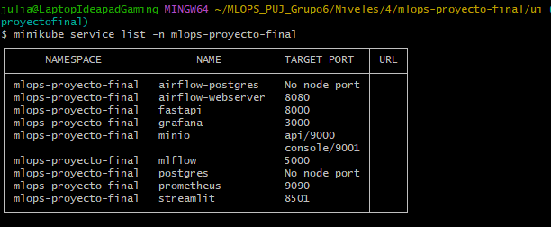

```

---

## 📊 Validación

### Ver datos en PostgreSQL
```bash
kubectl exec -it deployment/postgres -n mlops-proyecto-final -- \
  psql -U mlops_user -d raw_data -c "SELECT request_number, COUNT(*) FROM raw_data GROUP BY request_number;"
```


### Ver modelos en MLflow
```bash
# Acceder a MLflow UI
minikube service mlflow -n mlops-proyecto-final

# Verificar:
# - Experimento "real_estate_prediction"
# - Runs con métricas (rmse, mae, r2_score)
# - Modelo "real_estate_model" en Production
```

### Ver logs de Airflow
```bash
kubectl logs -f deployment/airflow-scheduler -n mlops-proyecto-final
```

---

## 📚 Estructura del Proyecto

```
mlops-proyecto-final/
├── README.md
├── .env.example
├── .gitignore
├── deploy.sh
├── .github/workflows/build-and-push.yml
├── airflow/
│   ├── Dockerfile
│   ├── requirements.txt
│   └── dags/ (4 DAGs)
├── api/
│   ├── Dockerfile
│   ├── main.py
│   └── requirements.txt
├── ui/
│   ├── Dockerfile
│   ├── app.py
│   └── requirements.txt
└── k8s/
    ├── postgres/
    ├── minio/
    ├── mlflow/
    ├── airflow/
    ├── api/
    ├── ui/
    ├── prometheus/
    └── grafana/
```